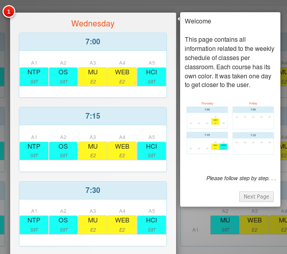

# Human Computer Interaction

### About Application 

App for organization courses using<b>drag-and-drop</b>technology.

#### Features:

- Add, Edit, Delete and Filter: Department, Classroom, Software and Course. 
- Drag and Drop Course on Schedule Table.
- Turn On/Off Help System with Guide and Hints

#### Technologies:

-  Java
-  Spring
-  AngularJS
-  Bootstrap
-  JPA/Hibernate

#### Libraries

- [angular-drag-and-drop-lists](https://github.com/marceljuenemann/angular-drag-and-drop-lists)
- [intro.js](https://introjs.com/) for Step-by-step guide and hints

#### weekly schedule

 
#### drag-and-drop

#### guide drag-and-drop

#### guide schedule

