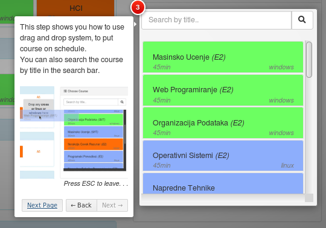

# Human Computer Interaction

## About Application 

App for organization courses using <b>drag-and-drop</b> technology.

#### Features:

- Add, Edit, Delete and Filter: Department, Classroom, Software and Course. 
- Drag and Drop Course on Schedule Table.
- Turn On/Off Help System with Guide and Hints

#### Technologies:

-  Java
-  Spring
-  AngularJS
-  Bootstrap
-  JPA/Hibernate

#### Libraries

- [angular-drag-and-drop-lists](https://github.com/marceljuenemann/angular-drag-and-drop-lists)
- [intro.js](https://introjs.com/) for Step-by-step guide and hints

## How to run App:

- Just create database with name <b>'schedule'</b> or some other name but than update connection settings to db in application.properties. Tables and columns will be created automatically.
- Set your username and password of database in application.properties - Default: username: <b>root</b>, password: <b>root</b> 

- Install [bower](https://tecadmin.net/install-bower-on-ubuntu/) for client dependencies. (AngularJS, Bootstrap..)
- Open terminal and go to schedule/src/main/resources/static and enter <b>'bower install'</b> to install all front-end dependencies. 

IntelliJ IDEA: 
- Just import project with maven 

Eclipse:
- Import project
- [Install](https://stackoverflow.com/a/46034044) Lombok

 

## App Screenshots:

### weekly schedule

 
### drag-and-drop

### guide

 &nbsp; &nbsp;
